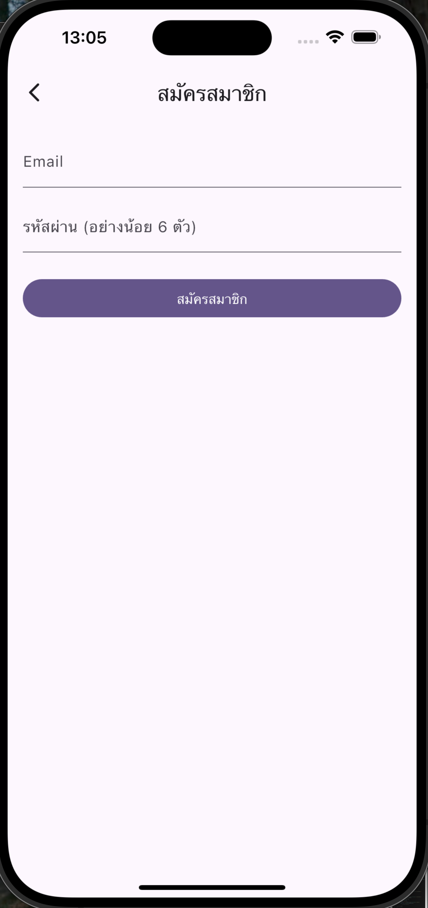
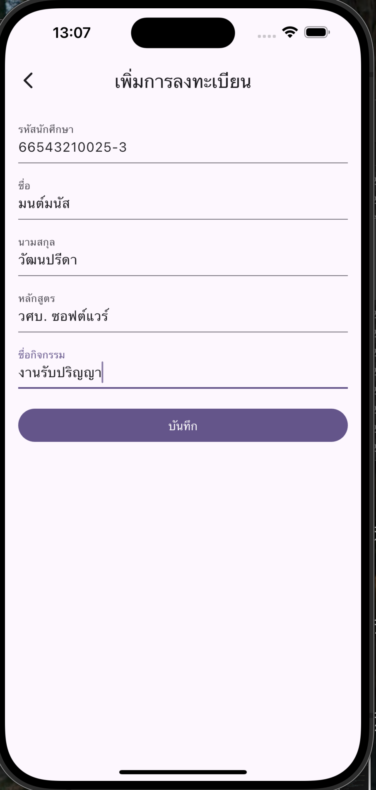
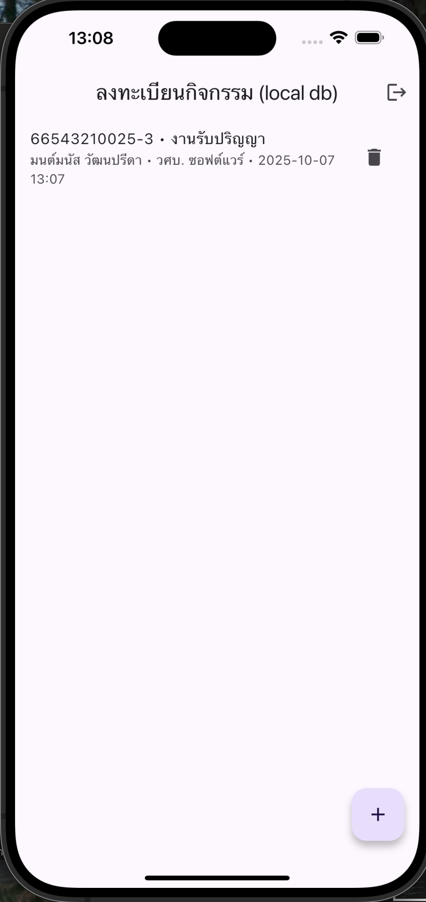
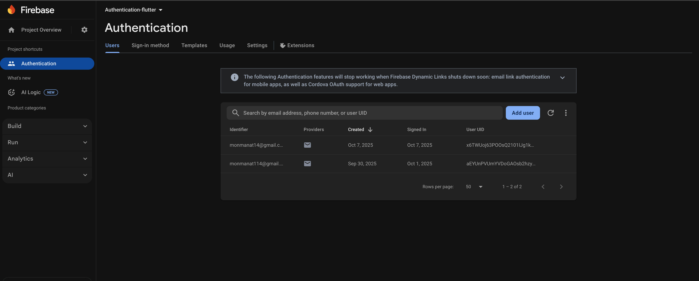

# 🔐 AS-11 – Firebase Authentication (Flutter) + Local SQLite

<p align="center">
  
  
  
  
</p>


แอปตัวอย่างสำหรับ **ลงทะเบียนการเข้าร่วมกิจกรรมของนักศึกษา**  
ใช้ **Firebase Authentication (Email/Password)** สำหรับเข้าสู่ระบบ และเก็บข้อมูลลง **SQLite (local database – `sqflite`)**

> โครงงานตามโจทย์: เก็บข้อมูลนักศึกษา — **รหัส, ชื่อ, นามสกุล, หลักสูตร, ชื่อกิจกรรม** (ผูกกับผู้ใช้ Firebase UID)

---

## ✨ คุณสมบัติเด่น
- สมัคร / เข้าสู่ระบบ ด้วย **Email + Password (Firebase Auth)**
- ฟอร์มบันทึกข้อมูลกิจกรรมลง **SQLite** (ออฟไลน์ได้)
- แสดงรายการที่บันทึก + ลบรายการได้
- แยกข้อมูลตามผู้ใช้ (อิง **Firebase UID**)

---

## 🧰 เทคโนโลยีที่ใช้
- Flutter 3.24+ (Material 3)
- Firebase Core, Firebase Auth
- sqflite, path, intl

---

## 📁 โครงสร้างโปรเจกต์ (สำคัญ)
```
lib/
 ├─ main.dart                        # เริ่มต้นแอป + Firebase.initializeApp
 ├─ firebase_options.dart            # ถูกสร้างโดย `flutterfire configure`
 ├─ models/
 │   └─ registration.dart            # โมเดลข้อมูลลงทะเบียน
 ├─ services/
 │   └─ db.dart                      # คลาส SQLite (CRUD)
 └─ screens/
     ├─ auth_gate.dart               # ตัดสินใจลำดับหน้า (ล็อกอิน/โฮม)
     ├─ sign_in_screen.dart          # หน้าล็อกอิน
     ├─ sign_up_screen.dart          # หน้าสมัครสมาชิก
     ├─ home_screen.dart             # รายการข้อมูล + ปุ่มเพิ่ม
     └─ registration_form.dart       # ฟอร์มบันทึกข้อมูล (รหัส/ชื่อ/หลักสูตร/กิจกรรม)
```

---

## ⚡ เริ่มต้นใช้งาน (Quick Start)

1) สร้างโปรเจกต์ Flutter
```bash
flutter create firebase_authentication_flutter
cd firebase_authentication_flutter
```

2) ติดตั้งแพ็กเกจ
```bash
flutter pub add firebase_core firebase_auth sqflite path intl
```

3) ติดตั้งและเชื่อม Firebase
```bash
dart pub global activate flutterfire_cli
flutterfire configure --platforms=android,ios,web
```
> เสร็จแล้วจะได้ไฟล์ `lib/firebase_options.dart` (ตัวจริง) โดยอัตโนมัติ

4) iOS ต้องตั้ง **iOS Deployment Target ≥ 15.0**
- แก้ไฟล์ `ios/Podfile`:
  ```ruby
  platform :ios, '15.0'
  ```
- จากนั้น
  ```bash
  cd ios
  pod deintegrate
  pod repo update
  pod install
  cd ..
  ```

5) เปิด Email/Password ใน Firebase Console  
**Authentication → Sign-in method → Enable Email/Password**

6) รันแอป
```bash
flutter clean
flutter pub get
flutter run
```

---

## 🖼️ สกรีนช็อต (ตัวอย่าง)
> วางรูปในโฟลเดอร์ `docs/` แล้วอ้างใน README ตามตัวอย่าง

- หน้า Sign In  
  

- หน้า Sign Up  
  

- หน้า Home (รายการลงทะเบียน)  
  

- ฟอร์มบันทึกกิจกรรม  
  

---

## 🧩 อธิบายโค้ดสำคัญ

### 1) `main.dart` – เริ่มต้น Firebase + โหลด `AuthGate`
```dart
import 'package:flutter/material.dart';
import 'package:firebase_core/firebase_core.dart';
import 'firebase_options.dart';   // สร้างโดย flutterfire configure
import 'screens/auth_gate.dart';

void main() async {
  WidgetsFlutterBinding.ensureInitialized();
  await Firebase.initializeApp(
    options: DefaultFirebaseOptions.currentPlatform,
  );
  runApp(const AS11App());
}

class AS11App extends StatelessWidget {
  const AS11App({super.key});
  @override
  Widget build(BuildContext context) {
    return MaterialApp(
      debugShowCheckedModeBanner: false,
      title: 'AS-11 Event Registration',
      theme: ThemeData(useMaterial3: true, colorScheme: ColorScheme.fromSeed(seedColor: const Color(0xFF7C3AED))),
      home: const AuthGate(),
    );
  }
}
```
**ภาพประกอบ:**  


---

### 2) `auth_gate.dart` – เช็กสถานะล็อกอินด้วย `authStateChanges()`
```dart
return StreamBuilder<User?>(
  stream: FirebaseAuth.instance.authStateChanges(),
  builder: (context, snapshot) {
    if (snapshot.connectionState == ConnectionState.waiting) {
      return const Scaffold(body: Center(child: CircularProgressIndicator()));
    }
    return snapshot.hasData ? const HomeScreen() : const SignInScreen();
  },
);
```
**ภาพประกอบ:**  


> ถ้า `hasData == true` แปลว่ามีผู้ใช้ล็อกอินแล้ว → ไป `HomeScreen`  
> ถ้าไม่ → ไป `SignInScreen`

---

### 3) `sign_in_screen.dart` – เข้าสู่ระบบด้วย Email/Password
```dart
await FirebaseAuth.instance.signInWithEmailAndPassword(
  email: _email.text.trim(),
  password: _password.text.trim(),
);
```
**ภาพประกอบ:**  


> แนะนำให้ทำ Validation (เช่นรูปแบบอีเมล/ความยาวรหัสผ่าน) และจัดการ error message

---

### 4) `sign_up_screen.dart` – สมัครสมาชิก
```dart
await FirebaseAuth.instance.createUserWithEmailAndPassword(
  email: _email.text.trim(),
  password: _password.text.trim(),
);
```
**ภาพประกอบ:**  


---

### 5) `services/db.dart` – โครงสร้างตาราง SQLite + CRUD
```sql
CREATE TABLE registrations(
  id INTEGER PRIMARY KEY AUTOINCREMENT,
  student_id TEXT NOT NULL,
  first_name TEXT NOT NULL,
  last_name TEXT NOT NULL,
  program TEXT NOT NULL,
  activity_name TEXT NOT NULL,
  created_at TEXT NOT NULL,
  user_uid TEXT NOT NULL
);
```
- ดึงรายการเฉพาะของผู้ใช้ปัจจุบันด้วยเงื่อนไข `WHERE user_uid = ?`
- แสดงผลเรียงใหม่ล่าสุดด้วย `ORDER BY id DESC`

**ภาพประกอบ:**  


---

### 6) `registration_form.dart` – บันทึกข้อมูล
เมื่อกดบันทึกจะสร้างออบเจ็กต์และ `insert` ลง SQLite:
```dart
final data = Registration(
  id: null,
  studentId: _studentId.text.trim(),
  firstName: _firstName.text.trim(),
  lastName: _lastName.text.trim(),
  program: _program.text.trim(),
  activityName: _activity.text.trim(),
  createdAt: DateFormat('yyyy-MM-dd HH:mm').format(DateTime.now()),
  userUid: FirebaseAuth.instance.currentUser!.uid,
);
await AppDb.instance.insert(data);
```
**ภาพประกอบ:**  


---

## 👨‍🔬 บัญชีทดสอบ (ชั่วคราว)
> เพิ่มผ่าน Firebase Console → Authentication → **Add user**

- `student1@test.example` / `Passw0rd!`
- `student2@test.example` / `Passw0rd!`

> เพื่อความปลอดภัย อย่าฝังบัญชีจริงใน repo สาธารณะ และ **ลบผู้ใช้เดโม** หลังส่งงาน

---

## 🧪 การทดสอบเบื้องต้น
- ✅ Flutter 3.24+  
- ✅ iOS Deployment Target ≥ 15.0  
- ✅ เปิด Email/Password ใน Firebase Console  
- ✅ `lib/firebase_options.dart` ต้องเป็นไฟล์ที่ `flutterfire configure` สร้างจริง

รัน:
```bash
flutter clean
flutter pub get
flutter run
```

---

## 🧯 Troubleshooting

### 1) Error: *UnimplementedError: Run flutterfire configure to generate firebase_options.dart*
- แปลว่าใช้งาน **placeholder** แทนตัวจริง
- วิธีแก้:
  - ลบ `lib/firebase_options.dart` เก่าที่เป็น placeholder
  - รันใหม่: `flutterfire configure --platforms=android,ios,web`

### 2) iOS Error: *requires a higher minimum iOS deployment version*
- ตั้ง `ios/Podfile` → `platform :ios, '15.0'`
- จากนั้นรัน `pod deintegrate && pod repo update && pod install`

### 3) macOS/zsh ไม่เจอคำสั่ง `flutterfire`
- เพิ่ม PATH
  ```bash
  echo 'export PATH="$PATH:$HOME/.pub-cache/bin"' >> ~/.zshrc
  source ~/.zshrc
  flutterfire --version
  ```

---

## 🚀 ส่งขึ้น GitHub (ชื่องานที่แนะนำ)
```bash
git init
git add .
git commit -m "AS-11 Firebase Auth + SQLite"
git branch -M main
git remote add origin git@github.com:YOUR_GITHUB_USERNAME/AS-11-Firebase-Authentication-flutter.git
git push -u origin main
```
ลิงก์ส่งงาน:
```
https://github.com/YOUR_GITHUB_USERNAME/AS-11-Firebase-Authentication-flutter
```

---

## 📜 License
MIT (แก้ไขตามที่คุณต้องการ)

---

> ต้องการไฟล์รูป UI ตัวอย่าง (PNG) ลงใน `docs/` ด้วยไหม? บอกชื่อหน้าที่อยากได้ เดี๋ยวผมแนบให้ครบชุดครับ 😊
